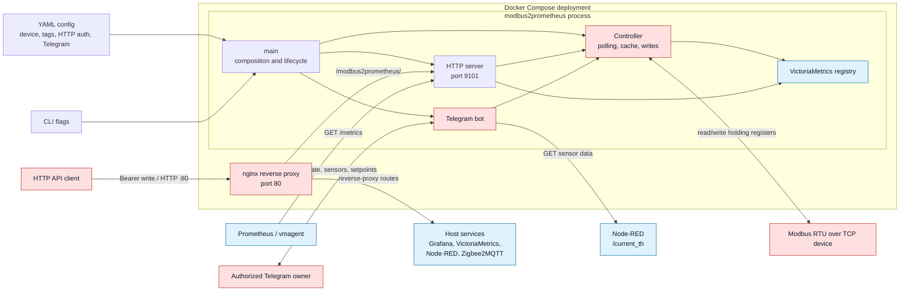

# modbus2prometheus

Prometheus exporter and controller for Modbus RTU over TCP. The service polls
holding registers, publishes their latest values through HTTP and Prometheus,
and writes configured setpoints through HTTP or a Telegram bot whose message
handlers use an owner allowlist.

## Requirements

- Go 1.25 for local builds.
- Access to a Modbus device supported by `github.com/simonvetter/modbus`.
- A Telegram bot token for the current startup path; the bot is not optional
  yet.
- Docker with Compose for the container deployment, or systemd for the native
  deployment.

## Architecture



Mermaid source: [docs/architecture.mmd](docs/architecture.mmd).

Detailed project documentation:

- [Project guide](docs/PROJECT_GUIDE.md)
- [Safe controller refactoring plan](docs/REFACTORING_PLAN.md)

## Configuration

The default configuration path is `./config.yaml`; pass another path with
`-config`. Modbus URL formats are documented by the
[Modbus library](https://github.com/simonvetter/modbus/blob/master/README.md).

Minimal RTU-over-TCP configuration:

```yaml
device-url: "rtuovertcp://192.168.1.200:8899"
device-id: 16
speed: 19200
timeout: 1s
polling-time: 1s
read-period: 10ms
tags:
  - name: "temp_floor"
    address: 513
    operation: "read_float"
  - name: "servo_otopl"
    address: 522
    operation: "read_uint"
telegram:
  apiToken: "<telegram-bot-token>"
  owners:
    123456789: "owner"
# Optional: omit this section to keep the legacy unauthenticated write API.
# http:
#   writeBearerToken: "<write-token>"
```

See [etc/modbus2prometheus.config.yaml](etc/modbus2prometheus.config.yaml) for
all tags used by the supplied deployment. Set `telegram.nodeRedUrl` to a base
URL reachable from the service when the `/sens_th` command is needed.

## HTTP endpoints

| Endpoint | Purpose |
| --- | --- |
| `GET /tags` | Latest tag values as JSON. |
| `GET /metrics` | Prometheus metrics. |
| `POST /api/v1/write` | Write a tag configured with `write_uint` or `write_float`. |

The write endpoint accepts a single JSON object such as
`{"name":"d_floor_ust","value":5}`. A successful write returns `204`; invalid
JSON returns `400`, an unknown tag returns `404`, a read-only tag returns `403`,
and a Modbus write failure returns `502`. Other HTTP methods return `405` with
`Allow: POST`. Request bodies are limited to 1 MiB and unknown JSON fields are
rejected.

Optional Bearer authentication protects only the write endpoint. Enable it in
the YAML configuration:

```yaml
http:
  writeBearerToken: "<write-token>"
```

Then send the same token in the request:

```bash
curl -i -X POST \
  -H 'Authorization: Bearer <write-token>' \
  -H 'Content-Type: application/json' \
  --data '{"name":"d_floor_ust","value":5}' \
  http://127.0.0.1:9101/api/v1/write
```

A missing or incorrect token returns `401`, JSON `{"error":"unauthorized"}`
and `WWW-Authenticate: Bearer`. If `http.writeBearerToken` is absent or empty,
authentication remains disabled for compatibility with existing configuration.
Do not expose that legacy mode outside a trusted network.

Under Docker Compose, prefix these paths with `/modbus2prometheus` on nginx
port 80. Both containers use host networking, the application also listens on
host port 9101, and the proxied write URL becomes
`/modbus2prometheus/api/v1/write`.

## Development

Run the same checks used by CI:

```bash
gofmt -l .
go test -race ./... -count=1
go vet ./...
go build ./...
```

`gofmt -l .` must produce no output. To build the local binary at
`build/modbus2prometheus`, run `make build`.

## Docker Compose

Compose expects the runtime configuration at
`/etc/modbus2prometheus.config.yaml` on the host:

```bash
docker compose -f docker/docker-compose.yml up --build -d
```

The nginx proxy listens on port 80. Its configuration also forwards routes to
Grafana, VictoriaMetrics, Node-RED, and Zigbee2MQTT running on the Docker host.

## Install as a systemd service

Build the binary first, then install the files at the paths used by the unit:

```bash
sudo install -Dm755 build/modbus2prometheus /opt/modbus2prometheus/modbus2prometheus
sudo install -Dm600 etc/modbus2prometheus.config.yaml /etc/modbus2prometheus.config.yaml
sudo install -Dm644 etc/systemd/system/modbus2prometheus.service /etc/systemd/system/modbus2prometheus.service
sudo systemctl daemon-reload
sudo systemctl enable --now modbus2prometheus.service
```

## Scraping metrics

Metrics are exposed at `/metrics`. The supplied vmagent example is
[etc/vmagent.scrape.config.yaml](etc/vmagent.scrape.config.yaml).
It scrapes the application on `127.0.0.1:9101`; the separate `9100` target in
that file is for node_exporter.

The supplied vmagent unit expects the binary at `/opt/vm/vmagent-prod` and uses
the following configuration paths:

```bash
sudo install -Dm644 etc/vmagent.scrape.config.yaml /etc/vmagent.scrape.config.yaml
sudo install -Dm644 etc/systemd/system/vmagent-scraper.service /etc/systemd/system/vmagent-scraper.service
sudo systemctl daemon-reload
sudo systemctl enable --now vmagent-scraper.service
```

Replace the `<user_id>` and `<token>` placeholders in the installed unit before
starting it. Do not commit real remote-write credentials.
