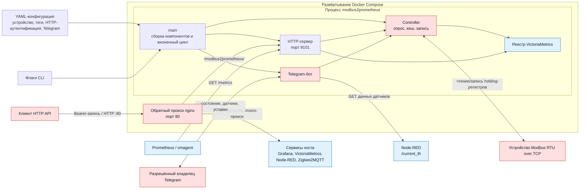

# modbus2prometheus

Экспортёр Prometheus и контроллер для Modbus RTU over TCP. Сервис опрашивает
holding-регистры, публикует последние значения через HTTP и Prometheus и
записывает настроенные уставки через HTTP или Telegram-бота. Обработчики
сообщений бота используют список разрешённых владельцев.

## Требования

- Go 1.25 для локальной сборки.
- Доступ к Modbus-устройству, поддерживаемому
  `github.com/simonvetter/modbus`.
- Токен Telegram-бота для текущего сценария запуска; пока бот не является
  опциональным.
- Docker с Compose для контейнерного развёртывания или systemd для нативного.

## Архитектура



Исходник Mermaid: [docs/architecture.mmd](docs/architecture.mmd).

Подробная документация проекта:

- [Руководство по проекту](docs/PROJECT_GUIDE.md)
- [План рефакторинга](docs/REFACTORING_PLAN.md)

## Конфигурация

Путь к конфигурации по умолчанию — `./config.yaml`; другой путь передаётся
флагом `-config`. Форматы Modbus URL описаны в документации
[библиотеки Modbus](https://github.com/simonvetter/modbus/blob/master/README.md).

Минимальная конфигурация RTU-over-TCP:

```yaml
device-url: "rtuovertcp://192.168.1.200:8899"
device-id: 16
speed: 19200
timeout: 1s
polling-time: 1s
read-period: 10ms
tags:
  - name: "temp_floor"
    address: 513
    operation: "read_float"
  - name: "servo_otopl"
    address: 522
    operation: "read_uint"
telegram:
  apiToken: "<telegram-bot-token>"
  owners:
    123456789: "owner"
# Опционально: без этой секции сохраняется устаревший API записи без аутентификации.
# http:
#   writeBearerToken: "<write-token>"
```

Все теги из поставляемого примера развёртывания перечислены в
[etc/modbus2prometheus.config.yaml](etc/modbus2prometheus.config.yaml). Если
нужна команда `/sens_th`, задайте в `telegram.nodeRedUrl` базовый URL,
доступный сервису.

## HTTP-интерфейс

| Путь | Назначение |
| --- | --- |
| `GET /tags` | Последние значения тегов в JSON. |
| `GET /metrics` | Метрики Prometheus. |
| `POST /api/v1/write` | Запись тега с операцией `write_uint` или `write_float`. |

Путь записи принимает один JSON-объект, например
`{"name":"d_floor_ust","value":5}`. Успешная запись возвращает `204`,
некорректный JSON — `400`, неизвестный тег — `404`, тег только для чтения —
`403`, ошибка записи Modbus — `502`. Остальные HTTP-методы возвращают `405` с
`Allow: POST`. Размер тела запроса ограничен 1 MiB; неизвестные поля JSON
отклоняются.

Опциональная Bearer-аутентификация защищает только путь записи. Она
включается в YAML-конфигурации. Создайте на хосте криптографически стойкий
256-битный токен:

```bash
openssl rand -hex 32
```

Сохраните созданное значение в конфигурации:

```yaml
http:
  writeBearerToken: "<write-token>"
```

Передавайте тот же токен в запросе:

```bash
curl -i -X POST \
  -H 'Authorization: Bearer <write-token>' \
  -H 'Content-Type: application/json' \
  --data '{"name":"d_floor_ust","value":5}' \
  http://127.0.0.1:9101/api/v1/write
```

Отсутствующий или неверный токен приводит к ответу `401`, JSON
`{"error":"unauthorized"}` и заголовку `WWW-Authenticate: Bearer`. Если
`http.writeBearerToken` отсутствует или пуст, аутентификация остаётся
выключенной для совместимости с существующей конфигурацией. Не коммитьте токен
в Git и ограничьте доступ к файлу конфигурации. Не открывайте устаревший режим
без аутентификации за пределами доверенной сети.

При использовании Docker Compose добавляйте к этим путям префикс
`/modbus2prometheus` на порту nginx `80`. Оба контейнера используют сеть хоста,
приложение также слушает порт хоста `9101`, а проксированный URL записи имеет вид
`/modbus2prometheus/api/v1/write`.

## Разработка

Запускайте те же проверки, что и CI:

```bash
gofmt -l .
go test -race ./... -count=1
go vet ./...
go build ./...
```

`gofmt -l .` не должен ничего выводить. Для сборки локального бинарника
`build/modbus2prometheus` выполните `make build`.

## Docker Compose

Docker Compose ожидает рабочую конфигурацию в
`/etc/modbus2prometheus.config.yaml` на хосте:

```bash
docker compose -f docker/docker-compose.yml up --build -d
```

Прокси nginx слушает порт `80`. Его конфигурация также перенаправляет маршруты
к Grafana, VictoriaMetrics, Node-RED и Zigbee2MQTT, запущенным на Docker-хосте.

## Установка как systemd-сервис

Сначала соберите бинарник, затем установите файлы по путям, используемым
юнитом:

```bash
sudo install -Dm755 build/modbus2prometheus /opt/modbus2prometheus/modbus2prometheus
sudo install -Dm600 etc/modbus2prometheus.config.yaml /etc/modbus2prometheus.config.yaml
sudo install -Dm644 etc/systemd/system/modbus2prometheus.service /etc/systemd/system/modbus2prometheus.service
sudo systemctl daemon-reload
sudo systemctl enable --now modbus2prometheus.service
```

## Сбор метрик

Метрики доступны по пути `/metrics`. Пример конфигурации vmagent находится в
[etc/vmagent.scrape.config.yaml](etc/vmagent.scrape.config.yaml). Он собирает
метрики приложения с `127.0.0.1:9101`; отдельная цель `9100` в этом файле
предназначена для node_exporter.

Поставляемый юнит vmagent ожидает бинарник в `/opt/vm/vmagent-prod` и использует
следующие пути конфигурации:

```bash
sudo install -Dm644 etc/vmagent.scrape.config.yaml /etc/vmagent.scrape.config.yaml
sudo install -Dm644 etc/systemd/system/vmagent-scraper.service /etc/systemd/system/vmagent-scraper.service
sudo systemctl daemon-reload
sudo systemctl enable --now vmagent-scraper.service
```

Перед запуском замените заполнители `<user_id>` и `<token>` в установленном
юните. Не коммитьте настоящие учётные данные для `remote_write`.
