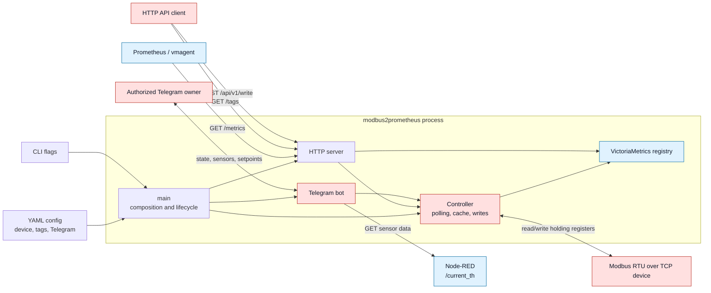

## modbus2prometheus

Simple prometheus exporter and controller for modbus RTU TCP protocol

### Architecture



Mermaid source: [docs/architecture.mmd](docs/architecture.mmd).

Detailed project map and refactoring documents:

- [Project guide](docs/PROJECT_GUIDE.md)
- [Safe controller refactoring plan](docs/REFACTORING_PLAN.md)

### Configuring

Modbus device url configuring with [doc for modbus library](https://github.com/simonvetter/modbus/blob/master/README.md)

Simple configuration for RTU via TCP modbus:
```yaml
device-url: "rtuovertcp://192.168.1.200:8899"
device-id: 16
speed: 19200
timeout: 1s
polling-time: 1s
read-period: 10ms
tags:
  - name: "temp_floor"
    address: 513
    operation: "read_float"
  - name: "servo_otopl"
    address: 522
    operation: "read_uint"
```

### Build

```bash
$ go build
```

### Install as service

You can copy files from ./etc/systemd/ folder to /etc/systemd/system and enable service

```bash
$ sudo cp ./etc/systemd/modbus2prometheus.config.yaml
$ sudo systemctl enable modbus2prometheus --now
```

### Scraping metrics

Metrics exporting to /metrics endpoint. You can scrape metrics with prometheus or vmagent service. Configuration for vmagent in /etc folder
